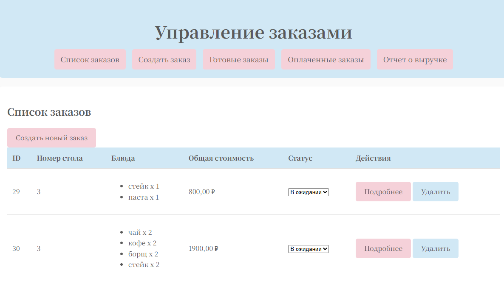
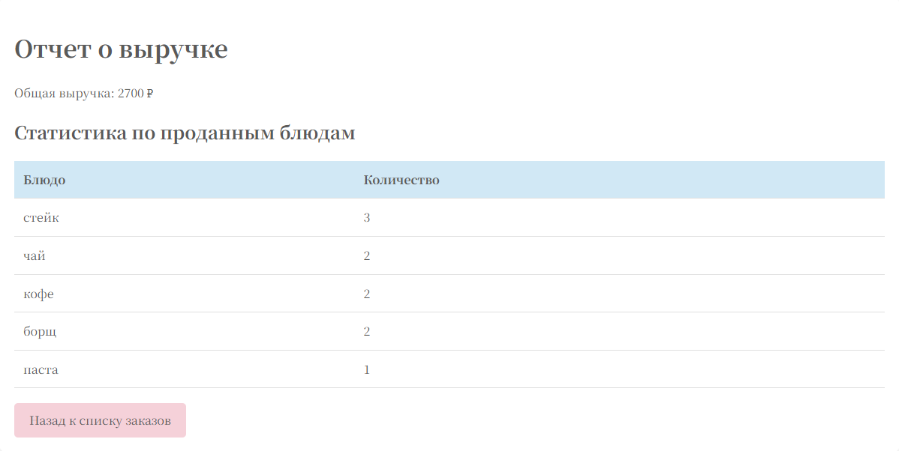
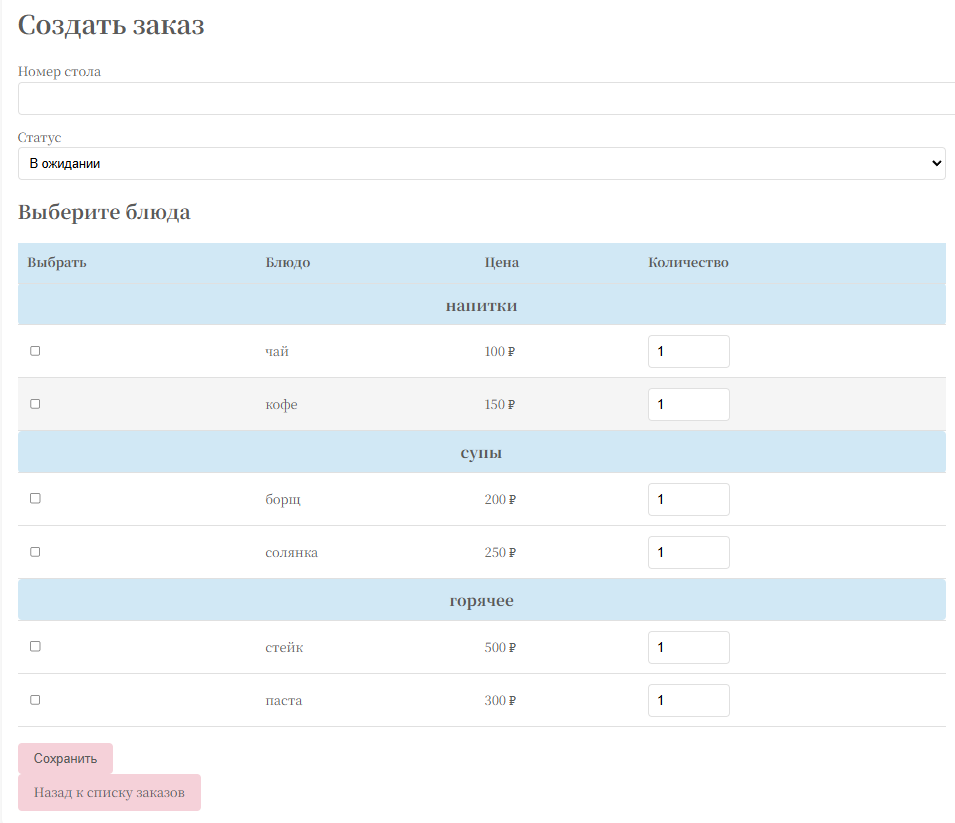
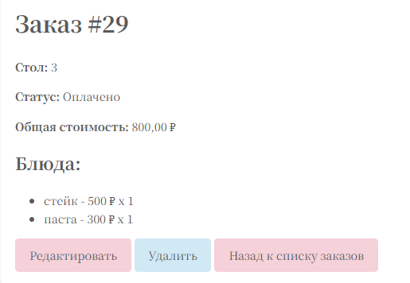

# Система управления заказами в кафе 🍽️

Это веб-приложение на Django для управления заказами в кафе или ресторане. Система позволяет эффективно управлять заказами, включая добавление, обновление, удаление и отображение заказов с отслеживанием их статусов. Также предоставляются детализированные отчеты о выручке и самые продаваемые блюда.

## Функциональные возможности ✨

### Управление заказами:
- **Добавление заказов**: Создание новых заказов с указанием номера стола и выбранных блюд.
- **Просмотр заказов**: Отображение всех заказов, включая их ID, номер стола, список блюд, общую стоимость и текущий статус.
- **Обновление заказов**: Изменение существующих заказов, включая обновление их статуса на «в ожидании», «готово» или «оплачено».
- **Удаление заказов**: Удаление заказов из системы.
- **Фильтрация заказов**: Поиск заказов по номеру стола или статусу.

### Отчеты о выручке 📊:
- **Общая выручка**: Рассчитывает общую выручку по заказам со статусом «оплачено».
- **Статистика по блюдам**: Показывает статистику о самых популярных блюдах.


## Технологический стек 🔧

- **Backend**: Django 4+
- **Frontend**: HTML/CSS (базовый интерфейс)
- **База данных**: SQLite
- **Версия Python**: 3.8+

---

## Инструкция по установке 🚀


### Требования

- Установленный Python 3.8+ на вашем компьютере.
- База данных SQLite.

### Шаги для запуска локально

1. **Клонируйте репозиторий:**
   ```bash
   git clone https://github.com/Kaishivee/django_cafe_management.git
   cd cafe_management
   ```
2. **Установите виртуальное окружение:**
```bash 
    python -m venv venv
    source venv/bin/activate  
    # Для Windows используйте 
    venv\Scripts\activate
```

3. **Установите зависимости:**
   ```bash
   pip install -r requirements.txt
   ```
   
4. **Настройте базу данных:**

   Примените миграции для создания необходимых таблиц базы данных:**
   ```bash
   python manage.py migrate
   ```

5. **Запустите сервер:**
   ```bash
   python manage.py runserver
   ```

## Модели 🛠️

Приложение использует следующие ключевые модели:

### **Order (Заказ):**
- `table_number`: Целое число, представляющее номер стола.
- `items`: JSONField для хранения списка блюд с их количеством и ценами.
- `total_price`: Числовое поле для хранения общей стоимости заказа.
- `status`: Поле выбора для отображения статуса заказа (например, «в ожидании», «готово», «оплачено»).

---

## API 📡

Приложение может также предоставить простой REST API для работы с заказами программно. Вы можете создавать, обновлять, удалять и получать заказы с помощью API.

### Пример эндпоинтов:
- **GET /orders/**: Получить список всех заказов.
- **POST /orders/**: Создать новый заказ.
- **GET /orders/{id}/**: Получить подробности конкретного заказа.
- **PUT /orders/{id}/**: Обновить существующий заказ.
- **DELETE /orders/{id}/**: Удалить заказ.

---


## Скриншоты 📸

#### Просмотр всех заказов в системе
  

#### Отчет о выручке с разбивкой по проданным блюдам.



#### Форма создания заказа


#### Детали заказа
